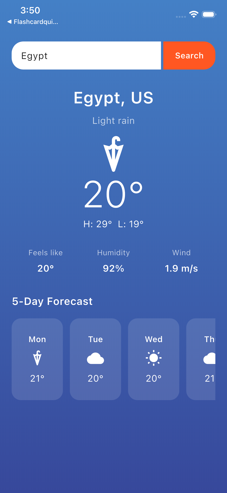

# Weather App

Started: **October 25, 2022**

A clean Flutter weather forecast app using the OpenWeatherMap 5-day forecast API.



## Features

- Current conditions with temperature, high/low, feels like, humidity, and wind
- 5-day forecast with weather icons
- City search
- Pull to refresh
- Loading, error, and empty states with retry

## Getting started

```bash
flutter pub get
flutter run
```

The OpenWeatherMap API key is set in `lib/config.dart`, so the app runs immediately.

## Project structure

```
lib/
  main.dart           App entry point
  home_screen.dart    Home screen and weather UI
  weather_api.dart    OpenWeatherMap networking
  config.dart         API configuration
  models/             Response models
assets/
  screenshot.png      App preview
```

## Notes

- Temperatures are requested in Celsius (`units=metric`).
- The default location matches the original project coordinates (northern Italy) until you search for a city.
